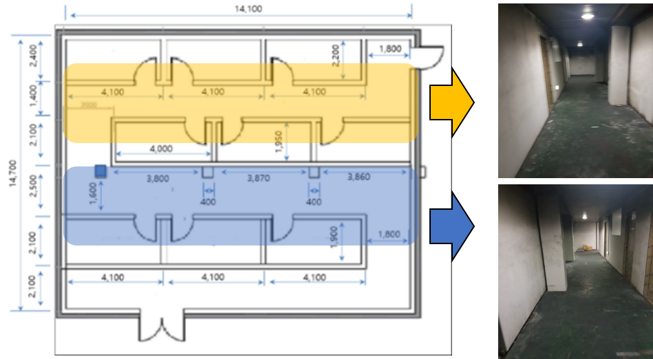
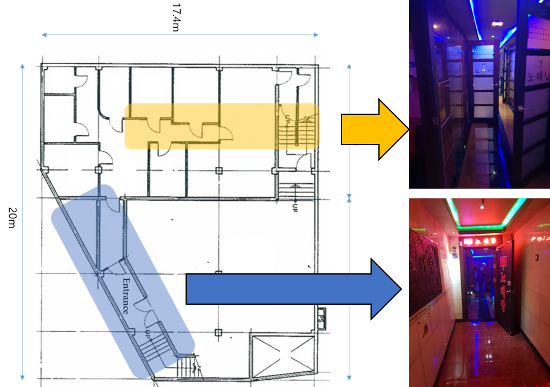
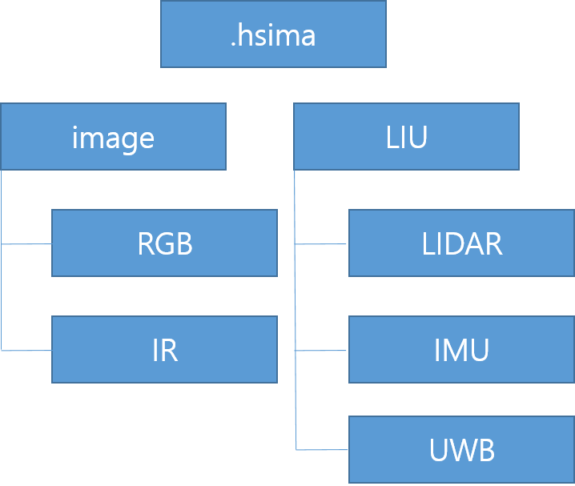

# Dataset
This dataset was acquired in a corridor style building and a narrow dwelling space as shown in Figure 1 and Figure 2.

Figure 1. Indooor environment 1

Figure 2. Indooor environment 2

This dataset consists of RGB images, thermal IR images, 2D LiDAR data, IMU data and UWB data as shown in Figure 3.

Figure 3. Data structure 

All data are provided in a compressed 'zip' format and stored in a folder with the date and time the data was collected.

## Data Format
- RGB images
Width: 640, Height: 480 8UC3

- Thermal IR images
Width: 160, Height: 120 16UC1

- 2D LiDAR data
Fov: 360, resolution: 0.3
[count, Vector<(quality, angle, distance)>]

- IMU data
[time, check, accel x, accel y, accel z, gyro x, gyro y, gyro z, NWU w, NWU x, NWU y, NUW z]

- UWB data
[try,data]

## Dataset Download
This dataset can be downloaded [here](https://drive.google.com/drive/folders/1pY3LgR_v4fpzPi170MBkokT65ScvDaCa?usp=sharing).

